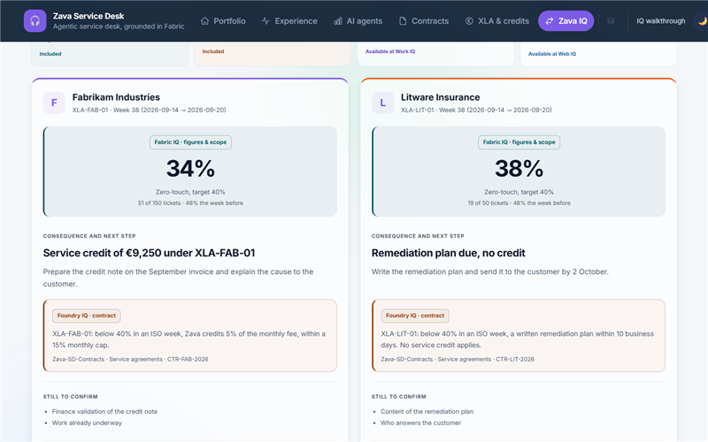
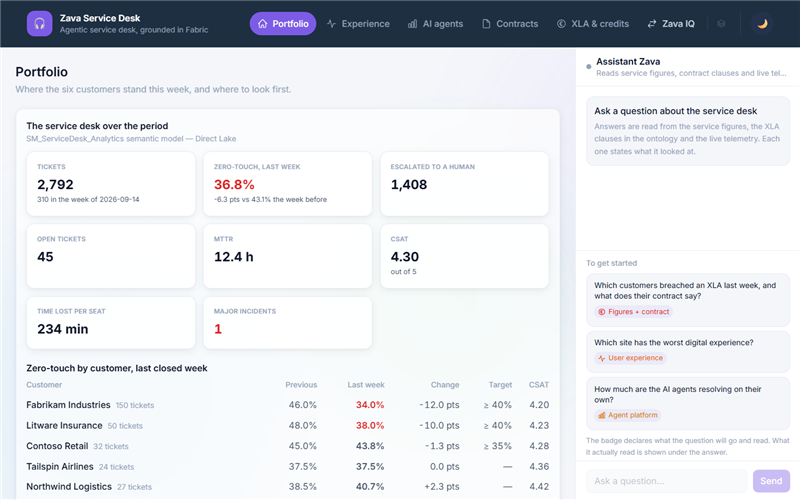
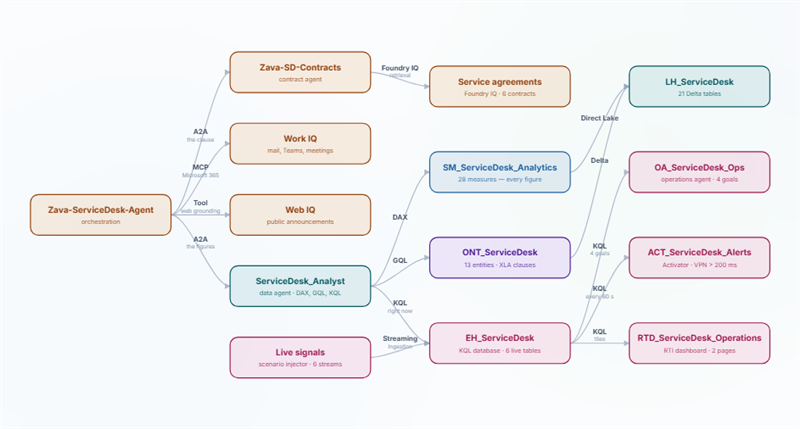
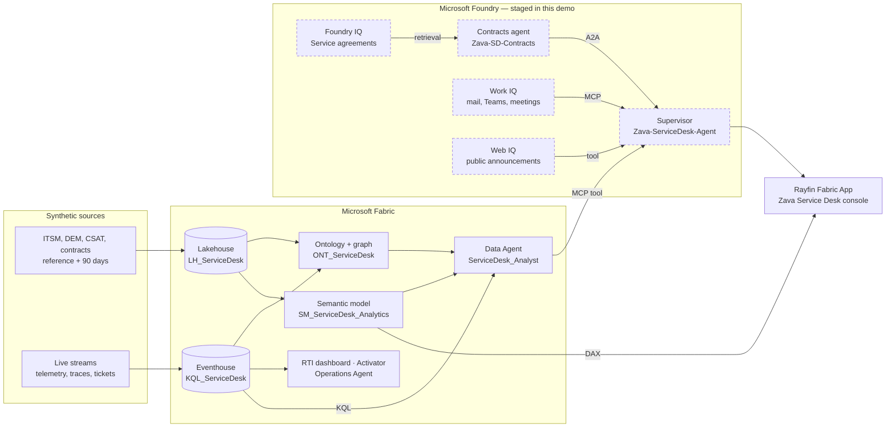

# Zava Service Desk — Fabric IQ × Foundry demo


<!-- HERO VISUAL — drop the teaser video here once recorded. Upload it via a GitHub
     comment to get a user-attachments URL; do not commit large media to the repo. -->

A managed service desk demo built on Microsoft Fabric and Microsoft Foundry. AI agents
resolve tickets on their own; running a whole service desk on them, for six customers and
under contract, needs one trusted context. The demo answers a question that neither the
data nor the contract can answer alone:

> **"Fabrikam and Litware both fell below the same 40% zero-touch XLA last week — what
> does each contract make Zava owe?"**

The rate is computed in Fabric, in DAX, over a Direct Lake semantic model. The clause is
retrieved by a Foundry contracts agent from a Foundry IQ knowledge base. The language
model routes, cites and phrases — it never computes, and never turns a clause into an
invented rule.

> **Synthetic data.** Zava is a fictional managed-service operator. Its customers,
> users, devices, tickets, contracts and clauses are generated from seed 42 by
> [`fabric/data/generate_data.py`](fabric/data/generate_data.py). No real customer, GUID
> or endpoint appears anywhere in this repository.

---

## Screens

| Zava IQ — from a breach to the right person | Portfolio — live DAX | Architecture — the chain |
|---|---|---|
|  |  |  |

---

## At a glance

| | |
|---|---|
| **Domain** | Managed IT service desk — tickets, digital employee experience, AI agents, XLAs |
| **Company** | Zava (fictional operator), six fictional customers: Contoso, Fabrikam, Litware, Northwind, Tailspin, Woodgrove |
| **Fabric items** | Lakehouse · Eventhouse · Ontology + graph (Fabric IQ) · Semantic model · Report · RTI dashboard · Activator · Operations Agent · Data Agent (MCP) · Rayfin app |
| **Foundry plane** | Supervisor agent · contracts agent · Foundry IQ knowledge base over the contracts · Work IQ · Web IQ — **staged in this demo** |
| **Hosted application** | Rayfin Fabric App · React/Vite console · single-tenant Entra SPA, delegated scopes, no secret |
| **Contracts** | Six service agreements, the same XLA vocabulary, **deliberately divergent** consequences |
| **Runs without a tenant?** | Data generation, live-stream replay and tests: yes. Deployment: no. |

---

## The question the demo answers

Two customers miss the same target in the same week. Their **numbers are close**. Their
**contractual consequences are opposite**.

| Customer, ISO week 38 | Zero-touch (previous week) | XLA | Contract | Answer |
|---|---:|---|---|---|
| Fabrikam Industries | **34.0%** (46.0%) | ≥ 40% | CTR-FAB-2026 · XLA-FAB-01 | **A service credit of 9,250 EUR** — 5% of the 185,000 EUR monthly fee, capped at 15% |
| Litware Insurance | **38.0%** (48.0%) | ≥ 40% | CTR-LIT-2026 | **No credit.** A written remediation plan within 10 business days — due 2 October |

The data says *"zero-touch fell 12 points."* The contract says *"5% of the monthly fee."*
Only the two together produce an answer. Behind the drop sits the storyline: a Corporate
VPN update breaks remote access at **Fabrikam Lyon**, the tickets pile up, the AI agents
escalate, and the zero-touch rate falls through the XLA.

An **XLA** (eXperience Level Agreement) commits to what users live through — zero-touch
rate, CSAT, device experience, time lost — where an SLA only commits to technical targets.

---

## The boundary rule

The data world stays on the data side.

- Measures, aggregation logic and entity semantics live in **Fabric** — in the semantic
  model, the ontology, the Eventhouse and the Data Agent that queries them.
- **Foundry** orchestrates, retrieves the contractual clause through Foundry IQ, and
  writes the answer. It **never reimplements a metric**.
- **Work IQ** and **Web IQ** add who already acts and what was announced publicly. They
  never produce a figure either.

The Fabric hop costs latency (the Data Agent takes 40–160 s per answer). That cost is
accepted deliberately: two definitions of "zero-touch", one in Fabric and one in a prompt,
would be unauditable.

---

## How it fits together



Two attachment kinds, and they are not interchangeable: the **Data Agent is a tool** — the
supervisor delegates the *question* and Fabric returns an *answer*. The **contract corpus
is a knowledge source** — text comes back and the contracts agent reasons over it.

The Fabric plane is deployed and live. The Foundry plane is **staged**: the console plays
it from versioned JSON (`app-zava-service-desk/src/data/iq-*.json`) with no Foundry
resource, and the screen carries no label about it — the presenter owns that framing, as
written in the [demo script](docs/demo/DEMO_SCRIPT.html).

---

## Repository structure

Deployment code is grouped **one folder per Fabric workload**. The folder tells you which
artifact the code produces.

| Path | What lives there |
|---|---|
| `deploy_all.py` | One-shot idempotent orchestrator, plus the pre-demo warm-up |
| `fabric/` | Deployment code, one package per workload — `_shared`, `data`, `workspace`, `lakehouse`, `eventhouse`, `ontology`, `graph`, `powerbi`, `rti`, `data_agent`, `app` |
| `app-zava-service-desk/` | The Rayfin console — React + Vite, live DAX, Data Agent assistant, Zava IQ |
| `docs/` | Architecture, deployment runbook, engineering notes, demo script, screenshots |
| `tests/` | The offline gate, run before every deploy |
| `scripts/` | Repository leak guard (also run in CI) |

Regenerate the full file list with `git ls-files` — it is not duplicated here, so it
cannot drift.

---

## Quick start

Offline first — no tenant, no network. Python 3.12, dependencies in
[`requirements.txt`](requirements.txt):

```bash
git clone https://github.com/Statyx/Fab-ServiceDesk-IQ.git
cd Fab-ServiceDesk-IQ
pip install -r requirements.txt
python -m fabric.data.generate_data                          # artifacts/data/, byte-identical everywhere
python -m fabric.eventhouse.inject_event --scenario vpn-lyon --loop --cycles 6 --out artifacts/live
python -m pytest tests -q                                    # offline gate
python scripts/check_repo_leaks.py                           # no tenant identifier in the repo
```

The console runs offline too: `npm ci`, `npm test` and `npx vite` in
`app-zava-service-desk/`, then open `/preview` to see every screen from fixtures.

Then deploy — idempotent and resumable. Needs a Fabric capacity (F-SKU or trial), the
Azure CLI signed in to the demo tenant, and Node.js 20+:

```bash
cp config.example.yaml config.yaml          # then fill the capacity and the expected account
python deploy_all.py --list                 # the steps, in order
python deploy_all.py                        # every step, then a warm-up
python deploy_all.py --from ontology        # resume after a failure
python -m fabric.app.deploy_app             # redeploy the console alone
```

A few steps are UI-only (Activator start, Operations Agent bindings). The
[deployment runbook](docs/DEPLOYMENT.md) lists them, with the MCP calls and the recorded
answers. Run `python deploy_all.py --warmup` right before the demo, to pay the cold start
off-stage.

---

## Documentation

| Document | For |
|---|---|
| [`docs/ARCHITECTURE.md`](docs/ARCHITECTURE.md) | Why the pieces are wired this way: data model, ontology, storyboard |
| [`docs/DEPLOYMENT.md`](docs/DEPLOYMENT.md) | Deploy steps, items, UI-only steps, the console, `state.json` |
| [`docs/ENGINEERING-NOTES.md`](docs/ENGINEERING-NOTES.md) | Failure modes and the workarounds that hold them |
| [`docs/demo/DEMO_SCRIPT.html`](docs/demo/DEMO_SCRIPT.html) | Screen by screen, what to say, live vs staged, plan B |

---

## License

MIT. See [LICENSE](LICENSE).
