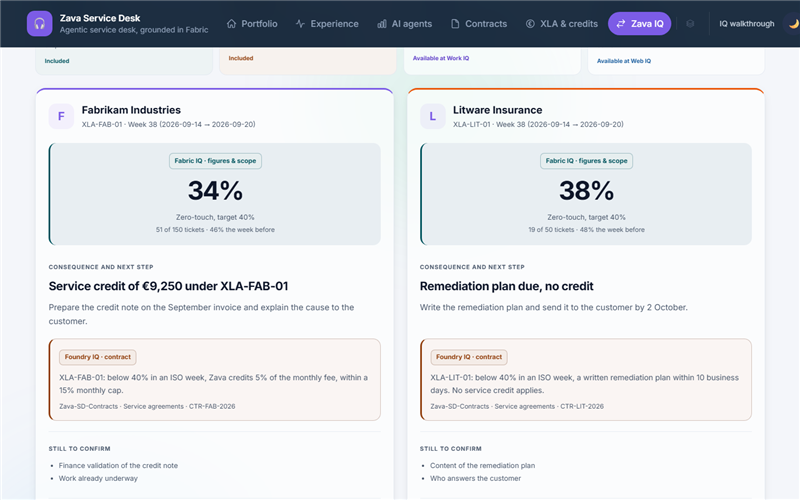
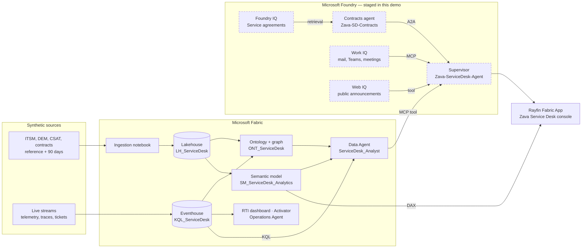
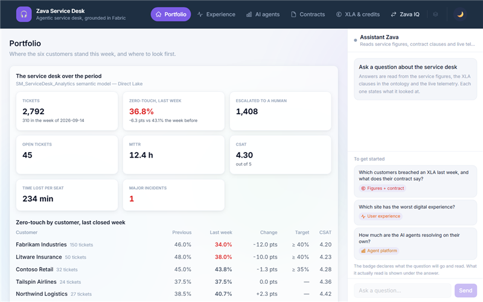
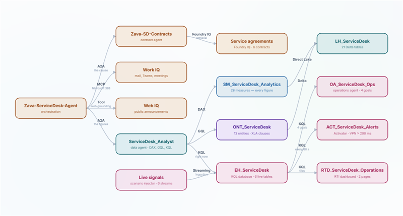

# Zava Service Desk — Fabric IQ × Foundry demo

**One trusted context for an AI-run service desk: Fabric computes how far the XLA fell,
the contract says what Zava owes.**

[](.github/workflows/no-client-leak.yml)


> **Synthetic data.** Zava is a fictional managed-service operator. Its customers, users,
> devices, tickets, contracts and clauses are generated from seed 42 by
> [`fabric/data/generate_data.py`](fabric/data/generate_data.py) out of
> [`fabric/data/world.yaml`](fabric/data/world.yaml). No real customer, GUID or endpoint
> appears anywhere in this repository.

<!-- HERO VISUAL — drop the teaser video here once recorded: upload it in a GitHub comment
     and paste the bare https://github.com/user-attachments/assets/<id> URL on its own line.
     Do not commit large media to the repo. -->



AI agents resolve tickets on their own. Running a whole service desk on them — six
customers, under contract — needs one trusted context. This demo answers a question that
neither the data nor the contract can answer alone:

> **"Fabrikam and Litware both fell below the same 40% zero-touch XLA last week — what
> does each contract make Zava owe?"**

- 📊 **The figure** comes from Fabric: DAX over a Direct Lake semantic model, the ontology
  and the Eventhouse, queried by a Fabric Data Agent.
- 📜 **The obligation** comes from the contract: a Foundry contracts agent retrieves and
  cites the clause from a Foundry IQ knowledge base.
- 🧭 **The context** comes from Work IQ and Web IQ: who already acts, what was announced.
- 🚫 **The language model never computes.** It routes, cites and phrases.

---

## Contents

- [At a glance](#at-a-glance)
- [The storyline](#the-storyline)
- [How it fits together](#how-it-fits-together)
- [Screens](#screens)
- [Repository structure](#repository-structure)
- [Prerequisites](#prerequisites)
- [Quick start](#quick-start)
- [Deploy to Fabric](#deploy-to-fabric)
- [Quality gate](#quality-gate)
- [Troubleshooting](#troubleshooting)
- [Contributing](#contributing)
- [Documentation](#documentation)
- [License](#license)

---

## At a glance

| | |
|---|---|
| **Domain** | Managed IT service desk — tickets, digital employee experience (DEM), AI agents, XLAs |
| **Company** | Zava (fictional operator), six fictional customers: Contoso, Fabrikam, Litware, Northwind, Tailspin, Woodgrove |
| **Fabric items** | Lakehouse · ingestion notebook · Eventhouse · Ontology + graph (Fabric IQ) · Semantic model · Report · RTI dashboard · Activator · Operations Agent · Data Agent (MCP) · Task flow · Rayfin app |
| **Foundry plane** | Supervisor agent · contracts agent · Foundry IQ knowledge base · Work IQ · Web IQ |
| **Hosted console** | Rayfin Fabric App · React + Vite · single-tenant Entra SPA, delegated scopes, no secret |
| **Runs without a tenant?** | Data generation, live-stream replay, tests and the console preview: yes. Deployment: no. |

**What is live and what is staged**

| Plane | State | Where it runs |
|---|---|---|
| Fabric — Lakehouse, Eventhouse, ontology, semantic model, report, RTI, Data Agent | 🟢 Live | Deployed by `deploy_all.py` into your workspace |
| Console — portfolio, customer pages, assistant | 🟢 Live | Evaluates named DAX measures; the assistant calls the Data Agent |
| Foundry — supervisor, contracts agent, Foundry IQ, Work IQ, Web IQ | 🎬 Staged | Played in the console from [`scenario.json`](app-zava-service-desk/src/features/iq-playground/scenarios/service-desk/scenario.json), no Foundry resource |

The screen carries no label about what is staged — the presenter owns that framing, as
written in the [demo script](docs/demo/DEMO_SCRIPT.html).

---

## The storyline

A Corporate VPN client update breaks remote access at **Fabrikam Lyon**. Tickets pile up,
the AI agents escalate instead of resolving, and the zero-touch rate falls through the XLA.
In the same week Litware misses the same target for a different reason. Their **numbers
are close**; their **contractual consequences are opposite**.

| Customer, ISO week 38 | Zero-touch (previous week) | XLA | Contract | What Zava owes |
|---|---:|---|---|---|
| Fabrikam Industries | **34.0%** (46.0%) | ≥ 40% | CTR-FAB-2026 · XLA-FAB-01 | **A 9,250 EUR service credit** — 5% of the 185,000 EUR monthly fee, capped at 15% |
| Litware Insurance | **38.0%** (48.0%) | ≥ 40% | CTR-LIT-2026 · XLA-LIT-01 | **No credit.** A written remediation plan within 10 business days — due 2 October |

These figures are asserted by the test suite and reproduced by `generate_data` (see
[Quick start](#quick-start)). At deploy time `--shift-weeks auto` moves the history so the
breach always lands in the last closed week.

An **XLA** (eXperience Level Agreement) commits to what users live through — zero-touch
rate, CSAT, device experience, time lost — where an SLA only commits to technical targets.

### The boundary rule

| Layer | Owns | Never does |
|---|---|---|
| **Fabric** (semantic model, ontology, Eventhouse, Data Agent) | Every measure, aggregation and threshold | — |
| **Foundry** (supervisor, contracts agent, Foundry IQ) | Orchestration, clause retrieval and citation, the written answer | Reimplement a metric |
| **Work IQ · Web IQ** | Who already acts, what was announced publicly | Produce a figure |
| **Console** (TypeScript) | Evaluates named DAX measures, renders them | Compute a rate, a credit or a threshold |

The Fabric hop costs latency — the Data Agent takes 40–160 s per answer. That cost is
accepted on purpose: two definitions of "zero-touch", one in Fabric and one in a prompt,
would be unauditable.

---

## How it fits together


```mermaid
flowchart LR
  subgraph src[Synthetic sources]
    CSV[ITSM, DEM, CSAT, contracts<br/>reference + 90 days]
    LIVE[Live streams<br/>telemetry, traces, tickets]
  end

  subgraph fabric[Microsoft Fabric]
    NB[Ingestion notebook]
    LH[(Lakehouse<br/>LH_ServiceDesk)]
    EH[(Eventhouse<br/>KQL_ServiceDesk)]
    ONT[Ontology + graph<br/>ONT_ServiceDesk]
    SM[Semantic model<br/>SM_ServiceDesk_Analytics]
    DA[Data Agent<br/>ServiceDesk_Analyst]
    RTI[RTI dashboard · Activator<br/>Operations Agent]
  end

  subgraph foundry[Microsoft Foundry — staged in this demo]
    SUP[Supervisor<br/>Zava-ServiceDesk-Agent]
    CTR[Contracts agent<br/>Zava-SD-Contracts]
    KB[Foundry IQ<br/>Service agreements]
    WIQ[Work IQ<br/>mail, Teams, meetings]
    WEB[Web IQ<br/>public announcements]
  end

  CSV --> NB --> LH
  LIVE --> EH
  LH --> ONT
  LH --> SM
  EH --> ONT
  EH --> RTI
  ONT --> DA
  SM --> DA
  EH -->|KQL| DA
  DA -->|MCP tool| SUP
  KB -->|retrieval| CTR
  CTR -->|A2A| SUP
  WIQ -->|MCP| SUP
  WEB -->|tool| SUP
  SUP --> APP[Rayfin Fabric App<br/>Zava Service Desk console]
  SM -->|DAX| APP

  classDef vision stroke-dasharray: 5 4
  class SUP,CTR,KB,WIQ,WEB vision
```

Dashed nodes are staged. Two attachment kinds, not interchangeable: the **Data Agent is a
tool** — the supervisor delegates the *question* and Fabric returns an *answer*. The
**contract corpus is a knowledge source** — text comes back and the contracts agent
reasons over it. The full rationale is in [`docs/ARCHITECTURE.md`](docs/ARCHITECTURE.md).

---

## Screens

| Screen | What to look at |
|---|---|
|  | **Zava IQ.** One prompt per IQ layer — Fabric IQ, Foundry IQ, Work IQ, Web IQ — each answer citing its source, then a recommendation and the Finance approval. The page scrolls with each click. |
|  | **Portfolio.** Every figure is a named DAX measure evaluated live against the semantic model — Fabrikam and Litware show red against their 40% target. |
|  | **Architecture.** The chain from synthetic sources to the console, with the boundary between Fabric and Foundry. |

---

## Repository structure

Deployment code is grouped **one package per Fabric workload** — the folder tells you which
artifact the code produces.

| Path | What lives there |
|---|---|
| [`deploy_all.py`](deploy_all.py) | One-shot idempotent orchestrator, plus the pre-demo warm-up |
| [`fabric/`](fabric) | One package per workload: `_shared`, `data`, `workspace`, `lakehouse`, `eventhouse`, `ontology`, `graph`, `powerbi`, `rti`, `data_agent`, `taskflow`, `app` |
| [`app-zava-service-desk/`](app-zava-service-desk) | The Rayfin console — React + Vite, live DAX, Data Agent assistant, Zava IQ |
| [`docs/`](docs) | Architecture, deployment runbook, engineering notes, demo script, screenshots |
| [`tests/`](tests) | The offline gate, run before every deploy |
| [`scripts/`](scripts) | Repository leak guard, also run in CI |
| [`config.example.yaml`](config.example.yaml) · [`state.example.json`](state.example.json) | Templates for the git-ignored tenant configuration |

Regenerate the full file list with `git ls-files` — it is not duplicated here, so it
cannot drift.

---

## Prerequisites

| Need | Version | For |
|---|---|---|
| Python | 3.12 | Data generation, tests, deployment — packages in [`requirements.txt`](requirements.txt) |
| Node.js | 20+ | The console (`npm ci` in `app-zava-service-desk/`) |
| Microsoft Fabric capacity | F-SKU or trial, **running** | Deployment only — a paused capacity answers 404 |
| Azure CLI | signed in with `az login` | Deployment only — the deploy refuses any account other than `deployment.expected_account` |
| Entra permission | create an SPA app registration | Deployment of the console only |

---

## Quick start

Offline first — no tenant, no network.

```bash
git clone https://github.com/Statyx/Fab-ServiceDesk-IQ.git
cd Fab-ServiceDesk-IQ
pip install -r requirements.txt
python -m fabric.data.generate_data        # writes artifacts/data/, byte-identical everywhere
python -m pytest tests -q                  # the offline gate
```

`generate_data` ends with the storyline, which is how you know the dataset is right:

```text
XLA breaches (closed windows):
  CUS-FAB XLA-FAB-01 zero_touch_rate ...: 34.0 vs 40.0 → credit 9,250.00 EUR
  CUS-LIT XLA-LIT-01 zero_touch_rate ...: 38.0 vs 40.0 → credit 0.00 EUR
```

Replay the live incident offline (writes the streams to files instead of the Eventhouse):

```bash
python -m fabric.eventhouse.inject_event --scenario vpn-lyon --loop --cycles 6 --out artifacts/live
```

Run the console from fixtures:

```bash
cd app-zava-service-desk
npm ci
npm test
npx vite                                   # then open /preview — every screen, no tenant
```

---

## Deploy to Fabric

Every step is idempotent: it finds its item by name and creates only what is missing.

```bash
cp config.example.yaml config.yaml         # fill the capacity and deployment.expected_account
python deploy_all.py --list                # the steps, in order
python deploy_all.py                       # every step, then a warm-up
```

| Option | Effect |
|---|---|
| `python deploy_all.py ontology graph` | Run only the named steps |
| `python deploy_all.py --from ontology` | Resume after a failure |
| `python deploy_all.py --skip app,taskflow` | Run everything except these |
| `python deploy_all.py --no-warmup` | Skip the final warm-up |
| `python deploy_all.py --warmup` | Warm-up only — run it right before the demo to pay the cold start off-stage |
| `python -m fabric.app.deploy_app` | Redeploy the console alone |

**Deploy only what changed.** A console change needs `deploy_app`, not a full run.

The steps, in order: `generate_data` → `workspace` → `lakehouse` → `setup_notebook` →
`eventhouse` → `preload` → `ontology` → `graph` → `semantic_model` → `verify_model` →
`report` → `dashboard` → `activator` → `operations_agent` → `data_agent` → `taskflow` →
`app`.

Configuration can also live in one folder per tenant under `deployments/<name>/` — all of
it git-ignored. Three steps stay **UI-only**: start the Activator, bind the Operations
Agent, import the task flow. The [deployment runbook](docs/DEPLOYMENT.md) lists them, with
the MCP calls and the recorded answers.

---

## Quality gate

A green suite is the definition of done.

```bash
python -m pytest tests -q
python scripts/check_repo_leaks.py         # stage new files first — it scans tracked files
cd app-zava-service-desk && npx vitest run && npm run lint && npm run build
```

CI ([`no-client-leak.yml`](.github/workflows/no-client-leak.yml)) runs the same gate on
every push — leak guard, dataset smoke run, pytest, console lint/test/build — and refuses
tracked generated data, local configuration and Windows-only scripts.

---

## Troubleshooting

Known failure modes — Fabric REST quirks, ontology and Data Agent traps, RTI, Rayfin — and
the workaround that holds each one are in
[`docs/ENGINEERING-NOTES.md`](docs/ENGINEERING-NOTES.md). The most common:

| Symptom | Fix |
|---|---|
| 404 on every Fabric call | The capacity is paused — resume it |
| The Data Agent is slow on the first question | Run `python deploy_all.py --warmup` before the demo |
| The deploy stops on "Signed in as …, profile expects …" | `az login` as `deployment.expected_account` from your config |
| A step failed half-way | Fix the cause, then `python deploy_all.py --from <step>` — finished items are reused |

---

## Contributing

The test suite enforces most of these rules; read
[`.github/copilot-instructions.md`](.github/copilot-instructions.md) for the full list.

- **Layout.** A new deploy script goes in the folder of the artifact it creates, as
  `deploy_<artifact>.py`, and is registered in `deploy_all.py`. Shared plumbing goes in
  `fabric/_shared/` only if it knows about no specific artifact.
- **Run as modules** from the repository root: `python -m fabric.ontology.deploy_ontology`.
- **Prologue.** Every runnable module calls `fabric._shared.platform_env.bootstrap()`
  before any third-party import. `winreg` is imported in `platform_env.py` only.
- **No secrets, no IDs.** No `shell=True`, no hard-coded GUID — identifiers live in the
  git-ignored `config.yaml` / `state.json` or `deployments/<name>/`.
  `rayfin/rayfin.yml` stays tenant-neutral.
- **Idempotent.** Find by name, create only what is missing.
- **Deterministic data.** Seed 42 from `world.yaml`; the storyline figures are tested.
- **Boundary.** Never compute a rate, a credit or a threshold in a prompt or in TypeScript.
- **UI wording.** Screens never label the storyline as simulated or offer a source-mode
  selector; the framing belongs in the demo script.

Open a pull request once the [quality gate](#quality-gate) is green.

---

## Documentation

| Document | For |
|---|---|
| [`docs/ARCHITECTURE.md`](docs/ARCHITECTURE.md) | Why the pieces are wired this way: data model, ontology, storyboard |
| [`docs/DEPLOYMENT.md`](docs/DEPLOYMENT.md) | Deploy steps, items, UI-only steps, the console, `state.json` |
| [`docs/ENGINEERING-NOTES.md`](docs/ENGINEERING-NOTES.md) | Failure modes and the workarounds that hold them |
| [`docs/demo/DEMO_SCRIPT.html`](docs/demo/DEMO_SCRIPT.html) | Screen by screen, what to say, live vs staged, plan B |

---

## License

MIT. See [LICENSE](LICENSE).
