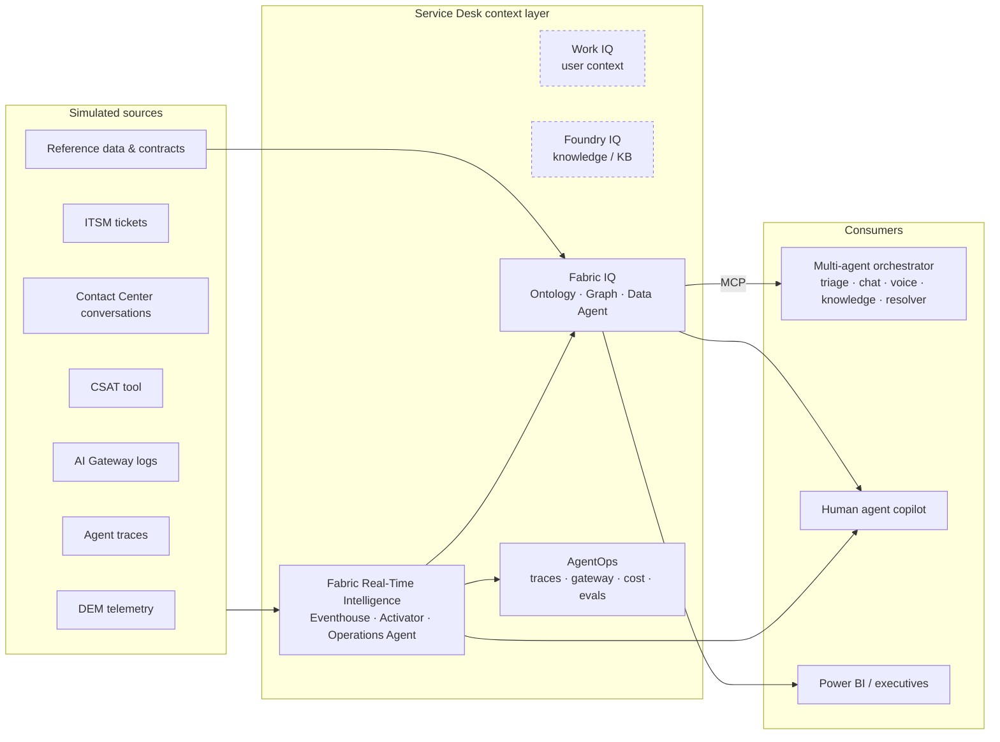
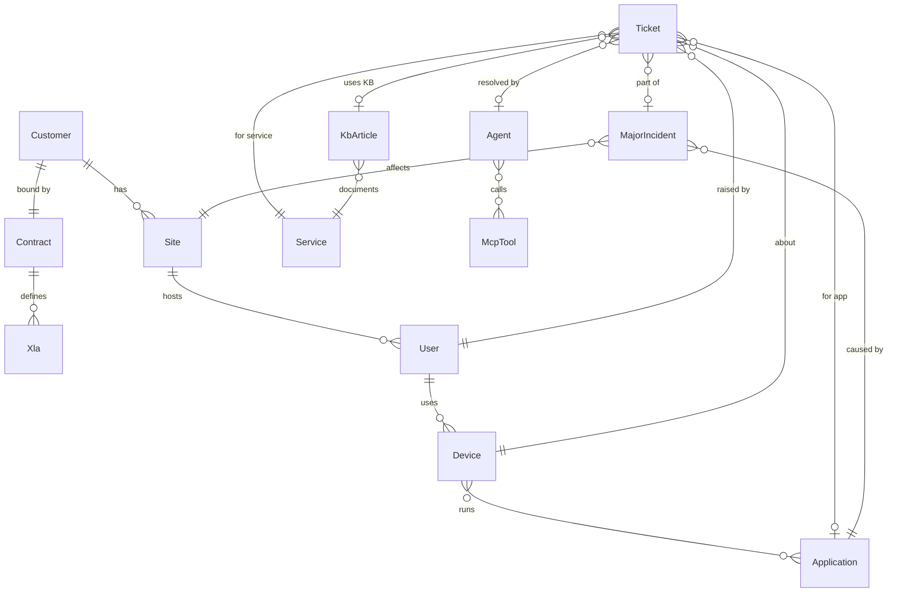

# Zava Service Desk — Architecture

> **Everything in this repository is fictional.** Zava is a fictional managed-service
> operator; its customers (Contoso, Fabrikam, Litware, Northwind, Tailspin, Woodgrove) are
> Microsoft's fictional companies; every user, device, ticket, contract and clause is
> generated from a seed. Third-party tools are named generically: *ITSM*, *DEM* (digital
> employee experience), *Contact Center*, *CSAT tool*, *Corporate VPN*.

## 1. Why this demo

AI agents can already answer a password reset. Running a **Service Desk** on agents, at
scale, for many customers and under contract, is a different problem: every agent decision
needs the same trusted context as a human analyst. Which users sit behind this device? Is
this outage already known? Is this user a VIP? What did we promise this customer, and are
we about to breach it?

The message: **no agentic service desk at scale without a data foundation.** This repo
builds that foundation on Microsoft Fabric. The agents that consume it are simulated.

## 2. Vision — a "Service Desk" layer on Microsoft IQ



| Layer | Role in the story | In this repo |
|---|---|---|
| **Work IQ** | Who the user is, what they work on, their meetings | Vision only |
| **Foundry IQ** | Knowledge retrieval over KB articles and runbooks | Vision only; KB metadata lives in `dim_kb_article` |
| **Fabric IQ** | Service Desk **ontology** + **graph** + **Data Agent** (`ServiceDesk_Analyst`), published as an **MCP** endpoint | Phase 2 |
| **Fabric RTI** | Eventhouse (6 live streams), Activator (alerts), Operations Agent (diagnosis) | Phase 2 |
| **AgentOps** | Observability of the agent platform itself, **per customer**: zero-touch, HITL escalations, MCP tool failures, latency, tokens, cost per contact | Phase 2 (RTI dashboard page) |

Consumers: a multi-agent orchestrator (external, simulated by `fabric.data_agent.mcp_client`),
the human agent's copilot, and Power BI. **No Microsoft Foundry and no Azure AI resource is
deployed.** Contracts and XLA clauses are structured data in the Lakehouse and the ontology,
so **both the number and the clause come from Fabric**.

### XLA vs SLA

An **SLA** is a technical commitment (a P1 answered in 15 minutes, 99.9% availability).
An **XLA**, or eXperience Level Agreement, commits to what the user actually experiences:
the share of contacts resolved with no human (**zero-touch**), **CSAT**, the device
**experience score**, and **time lost** to IT per seat. Missing an XLA can trigger a service
credit, so the operator must know, in near real time, which customer is drifting and what
it would cost.

## 3. Storyboard

A VPN client update (**6.1.0**) reaches the pilot ring at Fabrikam **Lyon** (80% of the site,
all Lyon VIPs included) on Monday 2026-06-08 at 07:00 UTC. The 20% of Lyon devices still on
**6.0.4** are the control group: they stay healthy, so the cause is the client version and
not the site network.

| # | Step | What happens | Fabric item (phase 2) |
|---|---|---|---|
| 1 | **Detect** | Experience score for Lyon 6.1.0 drops from about 81 to about 41. VPN disconnects appear, Teams MOS falls, tickets and negative conversations spike. | Eventhouse → RTI dashboard → **Activator** → Teams alert |
| 2 | **Diagnose** | The Operations Agent walks Device → Application → Site → Tickets → Users. Root cause: Corporate VPN 6.1.0 on the Lyon ring. Impact: 48 users, 8 of them VIPs. | Ontology + Graph, **Operations Agent** |
| 3 | **Act** | A major incident **MI-FAB-0001** (Sev2) is declared in the ITSM, impacted users get a proactive message, and an alert is posted to Teams. | Simulated MCP tools (`itsm.create_incident`, `cc.send_proactive_message`, `teams.post_alert`) |
| 4 | **Ground** | The orchestrator asks the Data Agent over MCP: *"Is USR-FAB-0061 impacted?"* The answer is yes, the incident is known, so it can reply without escalating (zero-touch). | **Data Agent** `ServiceDesk_Analyst` (MCP) |
| 5 | **AgentOps** | Per-customer view: `dem.get_device_health` fails on ~70% of Fabrikam incident contacts (≤15% elsewhere), AI Gateway 429s reach ~11% for Fabrikam, HITL escalations rise, and cost per contact stays around 0.02 EUR. | RTI dashboard page *AgentOps* |
| 6 | **Value** | *"Zero-touch dropped 12 points at Fabrikam this week. Are we in XLA breach, and what is the penalty?"* | Data Agent (DAX for the number, ontology for the clause) |

**Expected answers** (reproducible, asserted by `tests/test_smoke.py`):

| Question | Answer |
|---|---|
| Fabrikam weekly zero-touch | week of 2026-06-01: 23/50 = **46.0%** → week of 2026-06-08: 51/150 = **34.0%** (−12 points) |
| Threshold | XLA-FAB-01: zero-touch ≥ **40.0%** per ISO week |
| Consequence | Breach → credit **5%** of the 185,000 EUR monthly fee = **9,250 EUR** (monthly cap 15%) |
| Why | 100 incident tickets and only 28 zero-touch, because the DEM health tool fails and contacts escalate to humans |
| Litware | Same drop (46.0% → 34.0%, a surge of non-automatable HR Portal access requests) and same 40% threshold, but XLA-LIT-01 carries **no credit**: Zava owes a written remediation plan within 10 business days. Same gap, different contract, different consequence. |
| Anyone else? | No other closed window breaches. Only closed windows are evaluated: complete ISO weeks and the months of April and May. |

## 4. Data model

The whole synthetic world is described in [`fabric/data/world.yaml`](../fabric/data/world.yaml)
(seed 42, history ending Sunday 2026-06-14). The generator is its only consumer, so the
dataset is **byte-identical on every machine**. Column names, order and types come from
[`fabric/data/schema.py`](../fabric/data/schema.py). Generated files go to `artifacts/data/`,
which is git-ignored and regenerated in ~3 s.

### Lakehouse `LH_ServiceDesk` (Delta; types string/bigint/double/datetime/boolean)

| Table | Grain / key | Rows | Notes |
|---|---|---|---|
| `dim_customer` | customer_id | 6 | Zava's customer tenants: industry, country, primary language, seats, monthly fee |
| `dim_site` | site_id | 15 | `FAB-LYO` = Fabrikam Lyon |
| `dim_user` | user_id | 700 | persona VIP / Office / Remote / Frontline, `is_vip`, language |
| `dim_device` | device_id | 700 | one device per user, `vpn_client_version` (6.1.0 only on the Lyon ring) |
| `dim_application` | app_id | 10 | Microsoft Teams, Outlook, Corporate VPN, Identity Portal, ERP, CRM… |
| `bridge_device_application` | device_app_id | ~6.2k | installed applications and versions |
| `dim_service` | service_id | 7 | Identity, Network & Remote Access, Collaboration… |
| `dim_kb_article` | kb_id | 44 (11 issues × 4 languages) | `zero_touch_eligible` |
| `dim_agent` | agent_id | 18 | 6 AI agents (supervisor, triage, chat, voice, knowledge, resolver) + 12 humans L1–L3 |
| `dim_mcp_tool` | tool_id | 10 | `itsm.*`, `dem.*`, `kb.search`, `identity.*`, `cc.send_proactive_message`, `teams.post_alert` |
| `dim_contract` | contract_id | 6 | fee, term, `penalty_cap_pct` |
| `dim_xla` | xla_id | 14 | metric, comparator, threshold, window (weekly/monthly), `penalty_pct`, **`clause_text`** |
| `dim_date` | date | 90 | ISO week, month |
| `fact_ticket` | ticket_id | ~2.8k | channel, priority, `zero_touch`, `escalated_hitl`, `resolved_by_agent_id`, `time_lost_min`, `major_incident_id` |
| `fact_csat` | csat_id | ~1.2k | score 1–5 (zero-touch ≈ 4.5, human ≈ 4.2, incident ≈ 2.0) |
| `fact_experience_daily` | date × device | 63k | daily experience score, crashes, VPN latency, Teams MOS |
| `fact_major_incident` | major_incident_id | 1 | MI-FAB-0001: root cause, impacted users and VIPs |

XLA KPIs are **computed from the facts** (DAX in phase 2). There is no precomputed "breach"
table. `generate_data.evaluate_xla()` is the Python reference implementation the semantic
model must match.

### Eventhouse `EH_ServiceDesk` / `KQL_ServiceDesk` (types string/long/real/datetime/bool)

Preloaded with recent history (8 days of DEM, 14 days for the other streams), then fed live by
`fabric.eventhouse.inject_event` through direct ingestion. There is no Eventstream.

| Table | Content |
|---|---|
| `dem_telemetry` | hourly device health: experience score, VPN connected/latency, Teams latency/MOS, crashes, CPU/memory, `vpn_client_version` |
| `tickets_events` | created / updated / resolved events with channel, priority, zero-touch, HITL, major incident |
| `conversations` | chat / voice / Teams turns: language, speaker, intent, sentiment (−1..1), resolved by AI / escalated |
| `agent_traces` | OpenTelemetry-style spans (`invoke_agent` → `chat` / `execute_tool`): agent, MCP tool, model, tokens, latency, cost, status, error, groundedness/relevance evals, content safety, HITL |
| `gateway_logs` | AI Gateway calls: customer, agent, model, tokens, status (200/429/500), retries |
| `csat_events` | CSAT submissions |

The span schema imitates OpenTelemetry GenAI conventions in snake_case. It will be
reconciled with real agent traces if the demo is ever wired to a live platform.

## 5. Target ontology `ONT_ServiceDesk` (phase 2)



- **Entities**: Customer, Site, User, Device, Application, Service, Ticket, MajorIncident,
  KbArticle, Agent, McpTool, Contract, Xla. Each entity is bound to its `dim_*` / `fact_*`
  table, and every key is a string.
- **TimeSeries**: Device ← `dem_telemetry` (`device_id`, `timestamp`); Agent ← `agent_traces`
  (`agent_id`, `timestamp`).
- **Graph**: built from the ontology, then refreshed explicitly after each data load
  (build-and-push, then refresh).
- **Known pitfall**: TimeSeries properties queried through the ontology can come back empty.
  The Data Agent is therefore **multi-source**:
  - **GQL** on the ontology for traversal (who, what, which incident, which clause);
  - **DAX** on `SM_ServiceDesk_Analytics` for contractual numbers (zero-touch, CSAT, credits);
  - **KQL** on `KQL_ServiceDesk` for live signals.

## 6. Data Agent over MCP

`ServiceDesk_Analyst` is published and exposed as an **MCP** endpoint, so any external
orchestrator can use Fabric as its grounding tool. `fabric.data_agent.mcp_client` plays that
orchestrator. It speaks JSON-RPC 2.0 over streamable HTTP (`initialize` →
`notifications/initialized` → `tools/list` → `tools/call`), authenticates with an Entra token
for the Fabric scope, and handles JSON and SSE responses.

```text
python -m fabric.data_agent.mcp_client --dry-run "Is USR-FAB-0061 impacted by an open incident?"
python -m fabric.data_agent.mcp_client "Is Fabrikam in XLA breach this week, and what is the credit?"
```

`--dry-run` prints the exact messages without any tenant. The endpoint template in
`config.example.yaml` is an assumption to confirm when the agent is published in phase 2.
After that, `state.json` → `data_agent_mcp_url` wins.

## 7. Repository layout

```text
fabric/_shared/       paths · platform_env (bootstrap) · helpers (profiles, config/state, tokens, KQL)
fabric/data/          world.yaml · schema.py · generate_data.py
fabric/eventhouse/    inject_event.py
fabric/data_agent/    mcp_client.py
scripts/              check_no_client_leak.py (canonical, byte-identical) · check_repo_leaks.py
tests/                test_smoke.py · test_leak_scanner.py
deployments/          per-tenant profiles (git-ignored)
artifacts/            generated data (git-ignored)
```

Conventions shared with the sibling demos:
- Everything is Python and cross-platform. There are no `.ps1`, `.cmd` or `.bat` files.
- Modules run from the repo root with `python -m`.
- Every runnable module opens with the same prologue before any third-party import
  (`import os, sys` / `from fabric._shared.platform_env import bootstrap` / `bootstrap()`).
  `platform_env` is the only place that knows about Windows. `paths.py` is the only file
  that counts directory levels.
- Config resolution order: `ZAVA_SD_PROFILE_DIR` > `deployments/active-profile.json` > root
  `config.yaml`. A selected profile without its own `config.yaml` is an error, never a
  silent fallback.
- Deploy scripts will be idempotent and record item IDs in `state.json`.

## 8. Deployment order

**Phase 1 (this commit)** — scaffold, synthetic data, live injector, MCP client, offline tests,
leak guard and CI. Nothing is deployed.

**Phase 2 — Fabric**, one idempotent script per step, orchestrated by `deploy_all`:
1. Workspace `Zava Service Desk` on the capacity from config
2. Lakehouse `LH_ServiceDesk` + notebook `NB_Setup_ServiceDesk` (CSV → Delta)
3. Eventhouse `EH_ServiceDesk` / `KQL_ServiceDesk`: tables (`.create-merge`), streaming
   ingestion policy, history preload shifted to "now" by whole weeks
4. Ontology `ONT_ServiceDesk` (entities, relations, TimeSeries) → graph build-and-push → refresh
5. Semantic model `SM_ServiceDesk_Analytics` (Direct Lake, XLA measures) + report `RPT_ServiceDesk`
6. RTI dashboard `RTD_ServiceDesk_Operations` (pages *Operations*, *AgentOps*)
7. Activator `ACT_ServiceDesk_Alerts` (rules on the KQL tile queries → Teams)
8. Operations Agent `OA_ServiceDesk_Ops`
9. Data Agent `ServiceDesk_Analyst` (ontology + semantic model + KQL), published, MCP endpoint
   saved to `state.json`

**Phase 3 — App** `App-Zava-Service-Desk`: a Rayfin console that embeds the RTI dashboard, the
report and a chat with the Data Agent.

## 9. Hygiene

The repository is public. `scripts/check_repo_leaks.py` scans every tracked file for real
identifiers (GUIDs, tenant domains, personal paths, secrets) and, from a denylist kept
outside the repo (`.clientdeny` locally, `CLIENT_DENYLIST` secret in CI), for real customer
or partner names. CI runs it on every push, together with the offline test suite.
